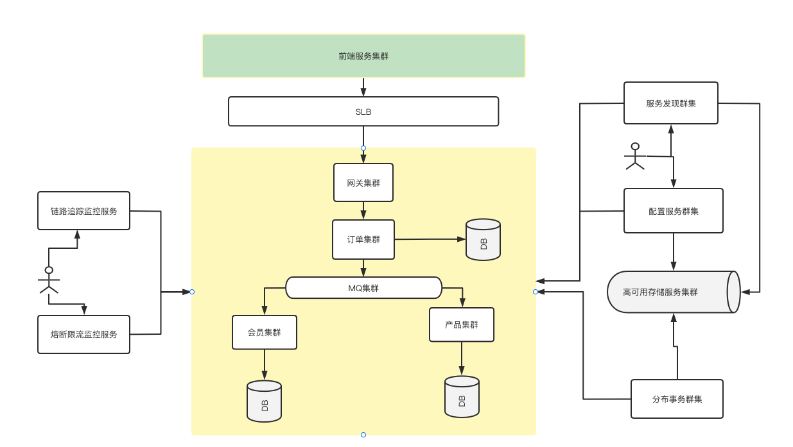
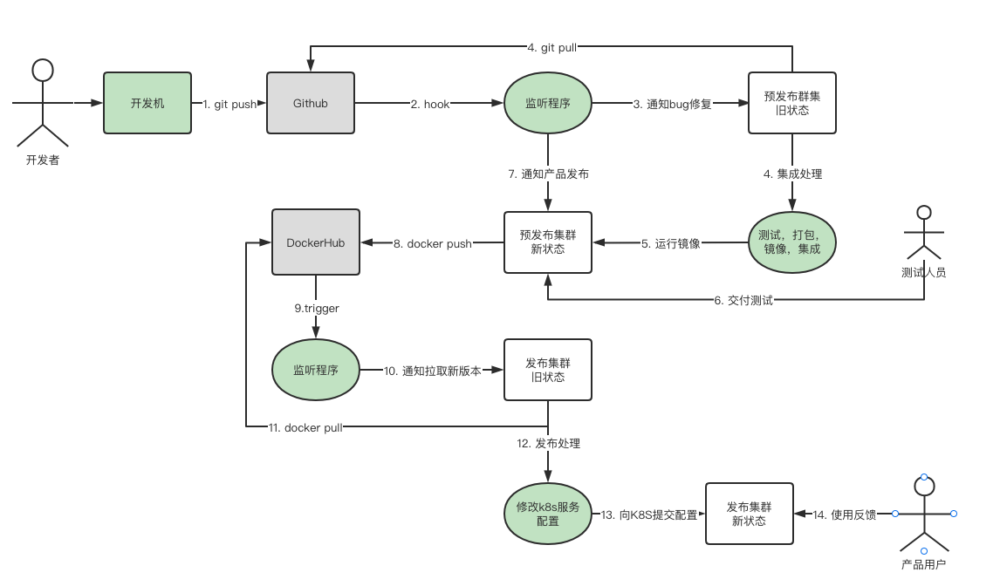

# 微服务及云原生开发基础环境 V.1.1
需要在本地环境启动：sentnel-dashboard,zipkin-server
1. sentnel-dashboard:
```shell
nohup java -jar -Dserver.port=8858 sentinel-dashboard-1.8.6.jar &
```
2. zipkin-server:
```shell
nohup java -jar zipkin-server-2.23.19-exec.jar &
```
3. 

